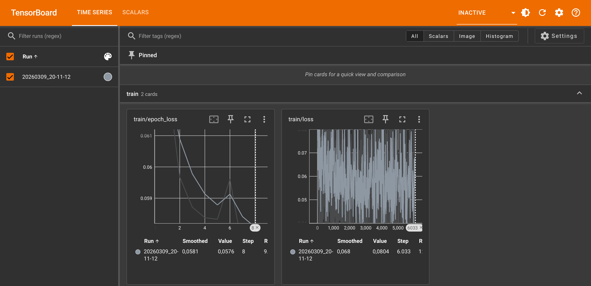
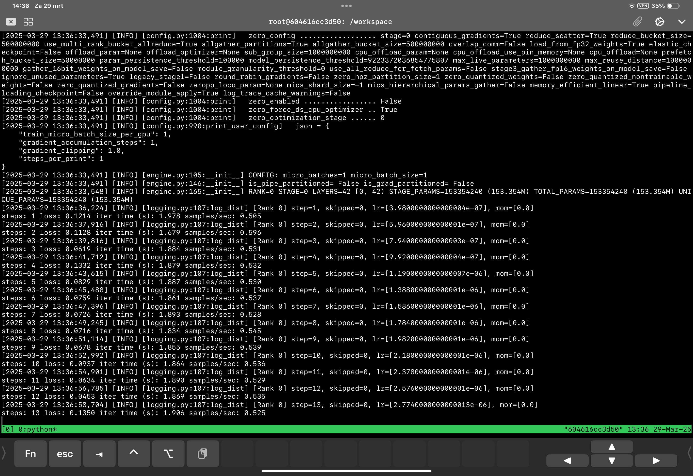

# run-diffusion-pipe on [RunPod.io](https://runpod.io?ref=se4tkc5o)

## Synopsis

A streamlined setup for running **diffusion-pipe** for **HunyuanVideo**, **Wan21**. 
This pod downloads models as specified in the **environment variables** set in the templates available on [RunPod.io](https://runpod.io?ref=se4tkc5o)

- Models are automatically downloaded based on the specified paths in the environment configuration.  
- Authentication credentials can be set via secrets for:  
  - **Code server** authentication (not possible to switch off) 
  - **Hugging Face** token for model access.  

Ensure that the required environment variables and secrets are correctly set before running the pod.
See below for options.

## Tensorboard on [RunPod.io](https://runpod.io?ref=se4tkc5o)



## Hardware provisioning

- [Runpod.io](https://runpod.io/)
- GPU A40 (cheapest option)
- Pod volume: 75Gb / 100 Gb

## Template [RunPod.io](https://runpod.io?ref=se4tkc5o)

- [HunyuanVideo](https://runpod.io/console/deploy?template=5avqh2xkq3&ref=se4tkc5o)
- [Wan21](https://runpod.io/console/deploy?template=w97tab8ql0&ref=se4tkc5o)

## Available Images

### Image

Base Image: ls250824/pytorch-cuda-ubuntu-develop:08122024

#### Custom Build: 

```bash
docker pull ls250824/run-diffusion-pipe:13042025
```

## Environment Variables  

### **Authentication Tokens**  

| Token        | Environment Variable |
|--------------|----------------------|
| Huggingface  | `HF_TOKEN`           |
| Code Server  | `PASSWORD`           |

### **Diffusion Models Setup Hunyuanvideo**  

| Model Type        | Model                   | Safetensors                        |
|-------------------|-------------------------|------------------------------------| 
| Diffusion Model   | `HF_MODEL_TRANSFORMER`  | `HF_MODEL_TRANSFORMER_SAFETENSORS` |
| VAE               | `HF_MODEL_VAE`          | `HF_MODEL_VAE_SAFETENSORS`         |
| LLM               | `HF_MODEL_LLM`          |                                    |
| CLIP              | `HF_MODEL_CLIP`         |                                    |

### **Diffusion Models Setup Wan21**  

| Model Type        | Model                   | Safetensors                        |
|-------------------|-------------------------|------------------------------------| 
| Checkpoint        | `HF_MODEL_CKPT`         |                                    |

## Connection options 

### Services

| Service         | Port          |
|-----------------|---------------| 
| **Tensorboard** | `6006` (HTTP) |
| **Code Server** | `9000` (HTTP) |
| **SSH/SCP**     | `22`   (TCP)  |

## Websites

- [diffusion-pipe](https://github.com/tdrussell/diffusion-pipe)
- [code server](https://github.com/coder/code-server)
- [tensorboard](https://www.tensorflow.org/tensorboard)
- [huggingface-cli](https://huggingface.co/docs/huggingface_hub/v0.27.0/guides/cli)

## Tutorial

- [Hunyuanvideo](https://civitai.com/articles/9798/training-a-lora-for-hunyuan-video-on-windows)
- [Wan21](https://www.stablediffusiontutorials.com/2025/03/wan-lora-train.html)

## Provisioning

- [hunyuanVideo](provisioning/hunyuanvideo.md)
- [Wan21](provisioning/wan21.md)

## Examples toml

- [Hunyuanvideo](examples/hunyuanvideo_config.toml)
- [Wan21](examples/wan21_config.toml)
- [dataset](examples/dataset.toml)

## Usage



### Start training A40 or L40S

```bash
deepspeed --num_gpus=1 /workspace/diffusion-pipe/train.py --deepspeed --config /workspace/x/config.toml
```

### Resume training (--resume_from_checkpoint)

```bash
deepspeed --num_gpus=1 /workspace/diffusion-pipe/train.py --deepspeed --resume_from_checkpoint --config /workspace/x/config.toml
```

### Start training RTX 4000

```bash
NCCL_P2P_DISABLE="1" NCCL_IB_DISABLE="1" deepspeed --num_gpus=1 /workspace/diffusion-pipe/train.py --deepspeed --config /workspace/x/config.toml
```

## 7z

### Add directory to encrypted archive

```bash
7z a -p -mhe=on output-training.7z /workspace/output/
```

### Extract directory from archive

```bash
7z x x.7z
```

## Split-Join

### Split

```bash
split -n 3 x.7z x_part
```

### Join files

```bash
cat x_part* > x.7z
```

## Bash commands

```bash
nvtop
htop
tmux
tmux attach
```

## Building the Docker Image 

This is not possible on [runpod.io](https://runpod.io?ref=se4tkc5o) use local hardware.
You can build and push the image to Docker Hub using the `build-docker.py` script.

### `build-docker.py` script options

| Option         | Description                                         | Default                |
|----------------|-----------------------------------------------------|------------------------|
| `--username`   | Docker Hub username                                 | Current user           |
| `--tag`        | Tag to use for the image                            | Today's date           |
| `--latest`     | If specified, also tags and pushes as `latest`      | Not enabled by default |

### Build & push Command

Run the following command to clone the repository and build the image:

```bash
git clone https://github.com/jalberty2018/run-diffusion-pipe.git

python3 run-diffusion-pipe/build-docker.py \
--username=<your_dockerhub_username> \
--tag=<custom_tag> \ 
run-diffusion-pipe
```

Note: If you want to push the image with the latest tag, add the --latest flag at the end.