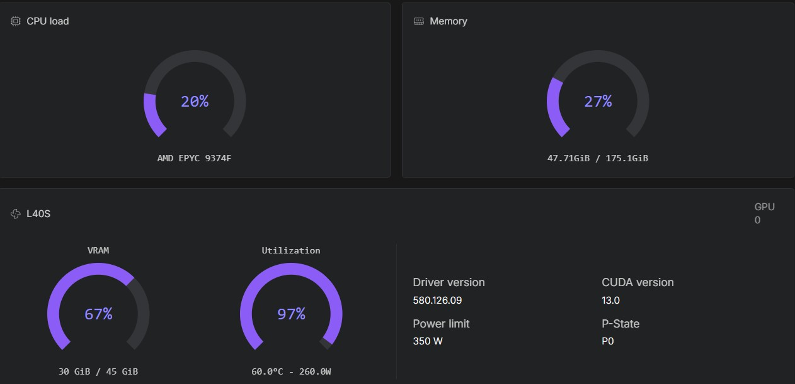
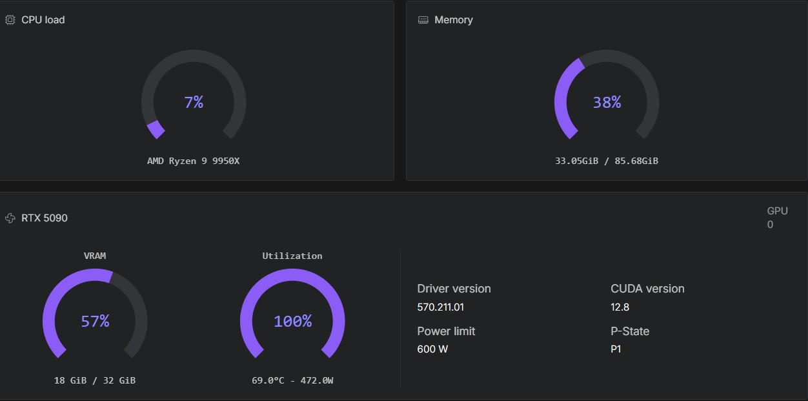
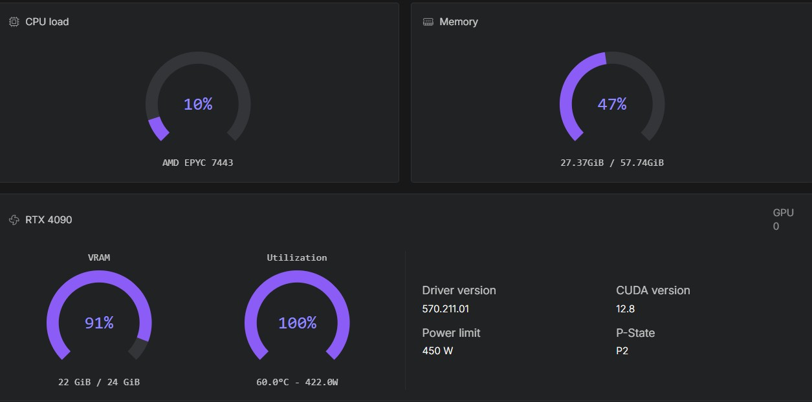
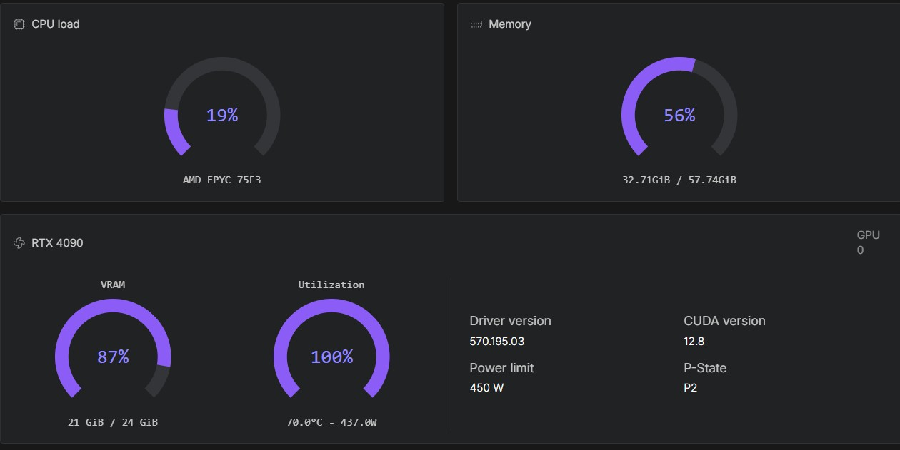

[](https://hub.docker.com/r/ls250824/run-diffusion-pipe)

# run-diffusion-pipe

## Synopsis

- Models are automatically downloaded based on the specified paths in the environment configuration.
- `/workspace` is persistent on RunPod. On first start the container moves `diffusion-pipe`, `README.md`, and `docs/` into `/workspace` and links them back to their original paths.
- Code Server starts on port `9000` and TensorBoard starts on port `6006` when CUDA is available.
- Authentication credentials can be set via secrets for:
  - **Code server** authentication (not possible to switch off)
  - **Hugging Face** token for model access.
  - **SSH/SCP** access when a public key is provided.

Ensure that the required environment variables and secrets are correctly set before running the pod.
See below for options.

## Tensorboard


## Training WAN 2.2 Lora on RunPod RTX A5000


## Training LTX 2.3 Lora on RunPod L40S



## Training ZIB Lora on RunPod RTX 5090 (RTX 4090 has better price/performance)



## Training FLUX-KLEIN-9B context Lora on RunPod RTX 4090



## Training Krea-2 Lora on RunPod RTX 4090



## Documentation

- [Resources](docs/diffusion_pipe_resources.md)
- [Model provisioning](docs/diffusion_pipe_provisioning.md)
- [Config examples](docs/diffusion_pipe_config_examples.md)
- [Start training](docs/diffusion_pipe_start_training.md)
- [Hardware Requirements](docs/diffusion_pipe_hardware.md)
- [Image setup](docs/diffusion_pipe_image_setup.md)
- [Environment variables](docs/diffusion_pipe_configuration.md)
- [RunPod environment templates](documentation/runpod-env-templates.md)

## Setup

- Base Image: ls250824/pytorch-cuda-ubuntu-develop:<[](https://hub.docker.com/r/ls250824/pytorch-cuda-ubuntu-develop)>

- Image: ls250824/run-diffusion-pipe:<[](https://hub.docker.com/r/ls250824/run-diffusion-pipe)>

## Building the Docker Image

You can build and push the image to Docker Hub using the `build_docker.py` script.

### `build_docker.py` script options

| Option         | Description                                         | Default                |
|----------------|-----------------------------------------------------|------------------------|
| `--username`   | Docker Hub username                                 | Current user           |
| `--tag`        | Tag to use for the image                            | Today's date           |
| `--latest`     | If specified, also tags and pushes as `latest`      | Not enabled by default |

### Build & Push Command

Run the following command to clone the repository and build the image:

```bash
git clone https://github.com/jalberty2018/run-diffusion-pipe.git
mv ./run-diffusion-pipe/build_docker.py ..

export DOCKER_BUILDKIT=1
export COMPOSE_DOCKER_CLI_BUILD=1

python build_docker.py \
--username=<your_dockerhub_username> \
--tag=<custom_tag> \
run-diffusion-pipe
```

Note: If you want to push the image with the `latest` tag, add the `--latest` flag at the end.
