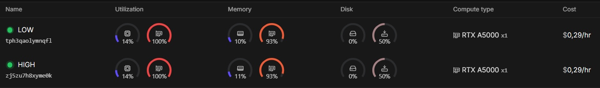
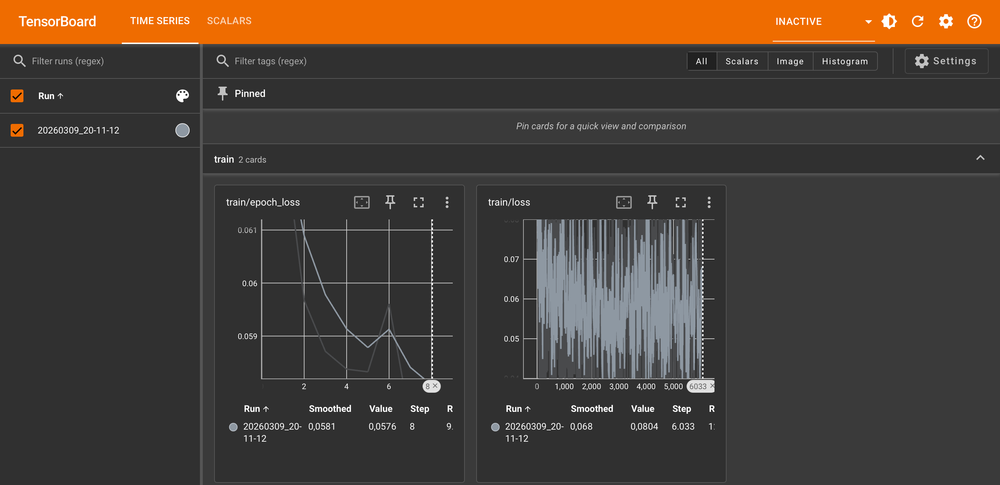

[](https://hub.docker.com/r/ls250824/run-diffusion-pipe)

# run-diffusion-pipe

## Synopsis

- Models are automatically downloaded based on the specified paths in the environment configuration.  
- Authentication credentials can be set via secrets for:  
  - **Code server** authentication (not possible to switch off) 
  - **Hugging Face** token for model access.  

Ensure that the required environment variables and secrets are correctly set before running the pod.
See below for options.

## Training WAN High/Low lora on RunPod



## Tensorboard



## 📚 Documentation

- [📚 Resources](docs/diffusion_pipe_resources.md)
- [📦 Model provisioning](docs/diffusion_pipe_provisioning.md)
- [🧩 Config examples](docs/diffusion_pipe_config_examples.md)
- [⚙️ Start training](docs/diffusion_pipe_start_training.md)
- [💻 Hardware Requirements](docs/diffusion_pipe_hardware.md)
- [⚙️ Image setup](docs/diffusion_pipe_image_setup.md)
- [⚙️ Environment variables](docs/diffusion_pipe_configuration.md)

## Setup

- Base Image: ls250824/pytorch-cuda-ubuntu-develop:<[](https://hub.docker.com/r/ls250824/pytorch-cuda-ubuntu-develop)>

- Image: ls250824/run-diffusion-pipe:<[](https://hub.docker.com/r/ls250824/run-diffusion-pipe)>

## Building the Docker Image 

This is not possible on [runpod.io](https://runpod.io?ref=se4tkc5o) use local hardware.
You can build and push the image to Docker Hub using the `build-docker.py` script.

### `build-docker.py` script options

| Option         | Description                                         | Default                |
|----------------|-----------------------------------------------------|------------------------|
| `--username`   | Docker Hub username                                 | Current user           |
| `--tag`        | Tag to use for the image                            | Today's date           |
| `--latest`     | If specified, also tags and pushes as `latest`      | Not enabled by default |

### Build & push Command

Run the following command to clone the repository and build the image:

```bash
git clone https://github.com/jalberty2018/run-diffusion-pipe.git
mv ./run-diffusion-pipe/build_docker.py ..

export DOCKER_BUILDKIT=1
export COMPOSE_DOCKER_CLI_BUILD=1

python build-docker.py \
--username=<your_dockerhub_username> \
--tag=<custom_tag> \ 
run-diffusion-pipe
```

Note: If you want to push the image with the latest tag, add the --latest flag at the end.
