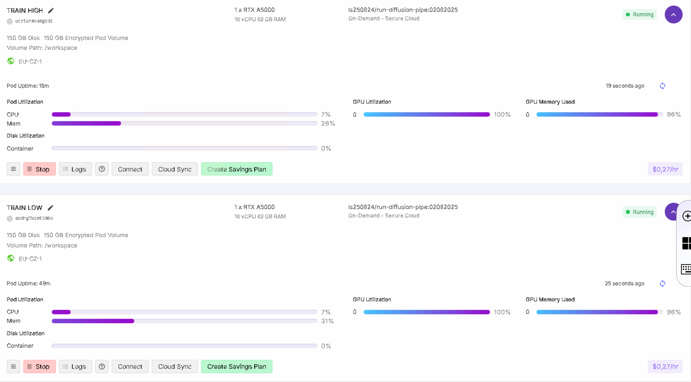

[](https://hub.docker.com/r/ls250824/run-diffusion-pipe)

# run-diffusion-pipe on [RunPod.io](https://runpod.io?ref=se4tkc5o)

## Synopsis

A streamlined setup for running **diffusion-pipe** for **HunyuanVideo**, **WAN** **Omnigen2**. 
This pod downloads models as specified in the **environment variables** set in the templates available on [RunPod.io](https://runpod.io?ref=se4tkc5o)

- Models are automatically downloaded based on the specified paths in the environment configuration.  
- Authentication credentials can be set via secrets for:  
  - **Code server** authentication (not possible to switch off) 
  - **Hugging Face** token for model access.  

Ensure that the required environment variables and secrets are correctly set before running the pod.
See below for options.

## Training WAN 2.2 image lora on [RunPod.io](https://runpod.io?ref=se4tkc5o)



## Tensorboard on [RunPod.io](https://runpod.io?ref=se4tkc5o)


## Hardware provisioning

- [Runpod.io](https://runpod.io/)
- GPU RTX A5000 , A40
- Pod volume: 80Gb / 100 Gb (depending on your dataset and model size)

## Template [RunPod.io](https://runpod.io?ref=se4tkc5o)

- [HunyuanVideo](https://runpod.io/console/deploy?template=5avqh2xkq3&ref=se4tkc5o)
- [Wan21](https://runpod.io/console/deploy?template=w97tab8ql0&ref=se4tkc5o)

## Setup

| Component | Version              |
|-----------|----------------------|
| OS        | `Ubuntu 22.x x86_64` |
| Python    | `3.11.x`             |
| PyTorch   | `2.7.1`              |
| CUDA      | `12.8`               |

## Available Images

### Image

```txt
Base Image: ls250824/pytorch-cuda-ubuntu-develop:<version>
```

[](https://hub.docker.com/r/ls250824/pytorch-cuda-ubuntu-develop)

#### Custom Build: 

```bash
docker pull ls250824/run-diffusion-pipe:<version>
```

## Environment Variables  

### **Authentication Tokens**  

| Token        | Environment Variable |
|--------------|----------------------|
| Huggingface  | `HF_TOKEN`           |
| Code Server  | `PASSWORD`           |

### **Diffusion Models Setup WAN and others**  

| Model Type        | Model                   |
|-------------------|-------------------------| 
| Checkpoint        | `HF_MODEL_CKPT`         |
| Diffusers         | `HF_MODEL_DIFFUSERS`    | 


### **Diffusion Models Setup Hunyuanvideo**  

| Model Type        | Model                   | Safetensors                        |
|-------------------|-------------------------|------------------------------------| 
| Diffusion Model   | `HF_MODEL_TRANSFORMER`  | `HF_MODEL_TRANSFORMER_SAFETENSORS` |
| VAE               | `HF_MODEL_VAE`          | `HF_MODEL_VAE_SAFETENSORS`         |
| LLM               | `HF_MODEL_LLM`          |                                    |
| CLIP              | `HF_MODEL_CLIP`         |                                    |
                                 
## Connection options 

### Services

| Service         | Port          |
|-----------------|---------------| 
| **Tensorboard** | `6006` (HTTP) |
| **Code Server** | `9000` (HTTP) |
| **SSH/SCP**     | `22`   (TCP)  |

## Websites

- [diffusion-pipe](https://github.com/tdrussell/diffusion-pipe)
- [code server](https://github.com/coder/code-server)
- [tensorboard](https://www.tensorflow.org/tensorboard)
- [huggingface hub](https://huggingface.co/docs/huggingface_hub/index)
- [Flash attention](https://github.com/Dao-AILab/flash-attention)

## Tutorial

- [Hunyuanvideo](https://civitai.com/articles/9798/training-a-lora-for-hunyuan-video-on-windows)
- [Wan](https://www.stablediffusiontutorials.com/2025/03/wan-lora-train.html)
- [Lora training](https://civitai.com/articles/3105/essential-to-advanced-guide-to-training-a-lora)

## Manuel provisioning

- [hunyuanVideo](provisioning/hunyuanvideo.md)
- [Wan 2.1](provisioning/wan21.md)
- [Wan 2.2](provisioning/wan22.md)
- [Omnigen2](provisioning/omnigen2.md)
- [Phantom](provisioning/phantom.md)
- [Qwen-image](provisioning/qwen-image.md)

## Supported models and information

- [doc](https://github.com/tdrussell/diffusion-pipe/blob/main/docs/supported_models.md)

## Example config_examples

- [Hunyuanvideo](config_examples/hunyuanvideo_config.toml)
- [Wan21](config_examples/wan21_config.toml)
- [Wan22](config_examples/wan22_config.toml)
- [Wan22 low noise](config_examples/wan22_low_noise_config.toml)
- [Wan22 high noise](config_examples/wan22_high_noise_config.toml)
- [Omnigen2](config_examples/omnigen2_config.toml)
- [Qwen-image](config_examples/qwen-image_config.toml)

## Example dataset

- [dataset](config_examples/dataset.toml)

## Start training RTX A5000, A40, L40S

### WAN 2.1 and others

```bash
deepspeed --num_gpus=1 /workspace/diffusion-pipe/train.py --deepspeed --config /workspace/x/config.toml
```

### Qwen Image 

```bash
pip uninstall diffusers
pip install git+https://github.com/huggingface/diffusers
deepspeed --num_gpus=1 /workspace/diffusion-pipe/train.py --deepspeed --config /workspace/x/config.toml
```

### WAN 2.2

```bash 
deepspeed --num_gpus=1 /workspace/diffusion-pipe/train.py --deepspeed --config /workspace/x/config_low.toml

deepspeed --num_gpus=1 /workspace/diffusion-pipe/train.py --deepspeed --config /workspace/x/config_high.toml
```

### Resume training (--resume_from_checkpoint)

```bash
deepspeed --num_gpus=1 /workspace/diffusion-pipe/train.py --deepspeed --resume_from_checkpoint --config /workspace/x/config.toml
```

## Building the Docker Image 

This is not possible on [runpod.io](https://runpod.io?ref=se4tkc5o) use local hardware.
You can build and push the image to Docker Hub using the `build-docker.py` script.

### `build-docker.py` script options

| Option         | Description                                         | Default                |
|----------------|-----------------------------------------------------|------------------------|
| `--username`   | Docker Hub username                                 | Current user           |
| `--tag`        | Tag to use for the image                            | Today's date           |
| `--latest`     | If specified, also tags and pushes as `latest`      | Not enabled by default |

### Build & push Command

Run the following command to clone the repository and build the image:

```bash
git clone https://github.com/jalberty2018/run-diffusion-pipe.git
mv ./run-diffusion-pipe/build_docker.py ..

python3 build-docker.py \
--username=<your_dockerhub_username> \
--tag=<custom_tag> \ 
run-diffusion-pipe
```

Note: If you want to push the image with the latest tag, add the --latest flag at the end.
